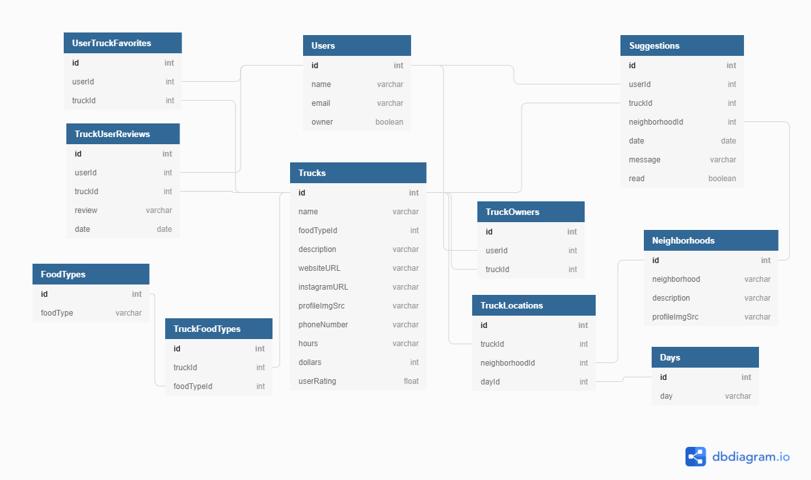

# Food Truck Finder

> Track You Favorite Food Trucks in Nashville 

---

### Table of Contents

- [Description](#description)
- [Featues](#features)
- [Technologies](#technologies)
- [Installation](#installation)
- [ERD](#erd)
- [License](#license)
- [Author Info](#author-info)

---

## Description

Food Truck Finder is an application for users to locate and keep track of their favorite food trucks in and around Nashville. Food trucks are an increasingly important part of a vibrant and happy community; they bring people together in a place where they can get great food, try something new, and sometimes even explore a different culture. The portability and limited menus that food trucks provide allow owners to react directly to the needs and wants of their customers. Sometimes, however, knowing where to find them can be a challenge. I wanted to build a tool that would help food truck owners and customers more easily find each other. 

This initial application was developed over the course of two weeks, primarily using the React library for JavaScript. My developmental goals throughout this build were to increase my understanding and proficiency of the use of props, as well as to further develop my skills at manipulating state to create a dynamic, responsive CRUD user interface.

## Features
- Users can view a list of food trucks currently located in Nashville.
- Users can filter food truck list by date, food type, and/or favorites, as well as sort the lsit by price range and average user rating.
- Users can view additional information and expanded weekly schedule for each truck and neighborhood by viewing their individual pages.
- Users can add trucks to their favorites list.
- User can rate and write reviews for individual trucks
- Truck Owners can register (and retire) trucks and edit details and location schedules

#### Technologies

- HTML5
- CSS3
- JavaScript
- React
- Git
- Github
- JSON Server
- Visual Studio Code

---


#### Installation
1. Clone this repository and change to the directory in the terminal.

```sh
git@github.com:MelissaCFox/Food-Truck-Finder.git
cd Food-Truck-Finder
```
2. Access the data

<a href="https://github.com/MelissaCFox/food-truck-finder-api" target="_blank" rel="noreferrer"></a>

3. Launch the application

```sh
npm install
npm start
```

---
### Demo
Preliminary Demo


#### ERD

---

## License

MIT License

Copyright (c) [2021] [Melissa C Fox]

Permission is hereby granted, free of charge, to any person obtaining a copy
of this software and associated documentation files (the "Software"), to deal
in the Software without restriction, including without limitation the rights
to use, copy, modify, merge, publish, distribute, sublicense, and/or sell
copies of the Software, and to permit persons to whom the Software is
furnished to do so, subject to the following conditions:

The above copyright notice and this permission notice shall be included in all
copies or substantial portions of the Software.

THE SOFTWARE IS PROVIDED "AS IS", WITHOUT WARRANTY OF ANY KIND, EXPRESS OR
IMPLIED, INCLUDING BUT NOT LIMITED TO THE WARRANTIES OF MERCHANTABILITY,
FITNESS FOR A PARTICULAR PURPOSE AND NONINFRINGEMENT. IN NO EVENT SHALL THE
AUTHORS OR COPYRIGHT HOLDERS BE LIABLE FOR ANY CLAIM, DAMAGES OR OTHER
LIABILITY, WHETHER IN AN ACTION OF CONTRACT, TORT OR OTHERWISE, ARISING FROM,
OUT OF OR IN CONNECTION WITH THE SOFTWARE OR THE USE OR OTHER DEALINGS IN THE
SOFTWARE.

---

## Author Info

- Github - [MelissaCFox](https://github.com/MelissaCFox)
- LinkedIn - [Melissa Fox](https://www.linkedin.com/in/melissacfox/)

[Back To The Top](#FoodTruckFinder)